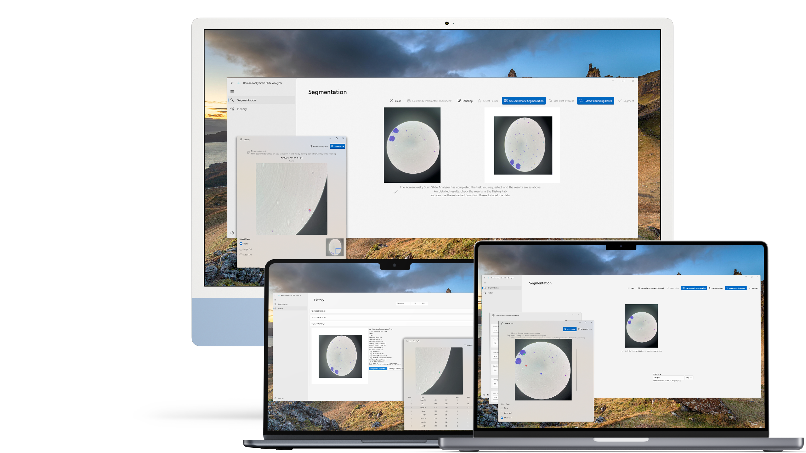 
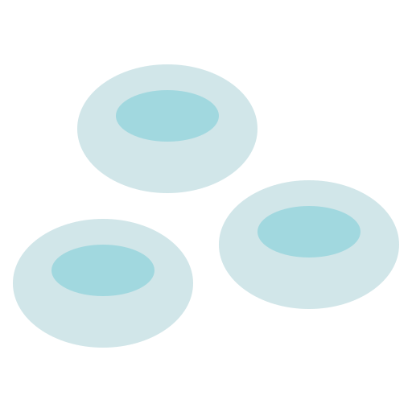 

# Romanowsky Stain Slide Analyzer for Windows 
> Segmentation & Labeling Tool for Data Learning and Verification Exclusive to Romanowsky Stain Slide Analyzer 
ⓒ 2024-2025 Changjin Ha. All Rights Reserved. 
---
## Segmentation 
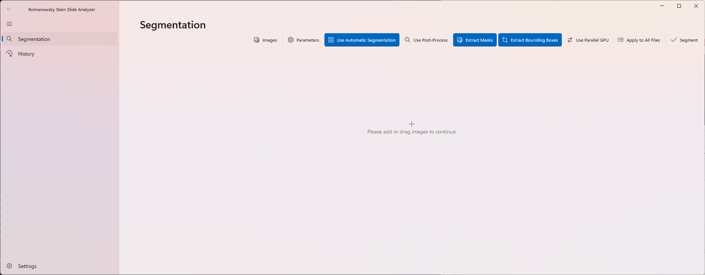 
> Just load the images, name the file, and segmentation is complete. 

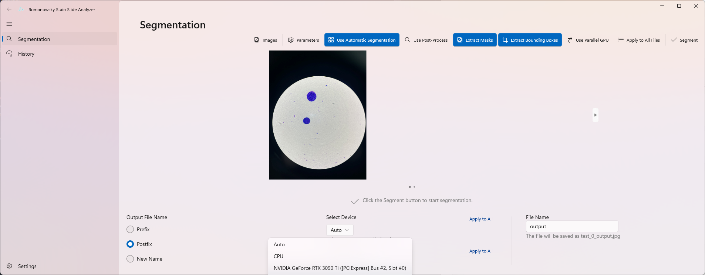 
> You can select GPU to segment. 

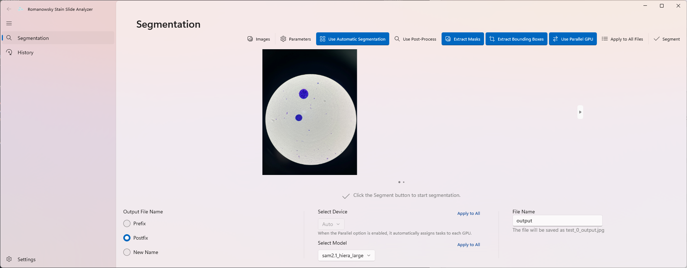 
> Also, you can use GPU Parallel for use multiple GPUs. 

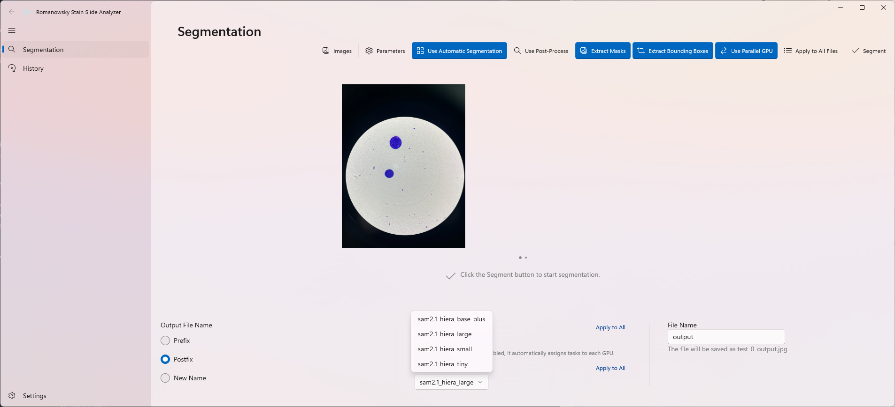 
> And you can choose model to use. 

### Customize Parameters 
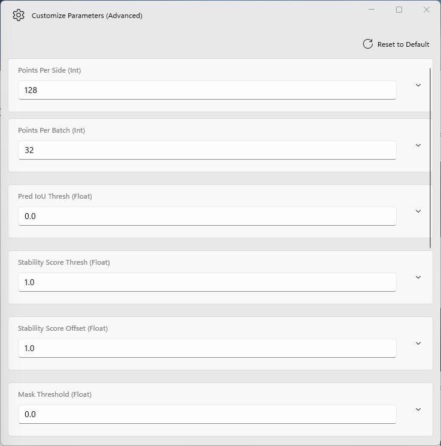 
> If you proceed with Automatic Segmentation, you can also modify SAM parameters. 

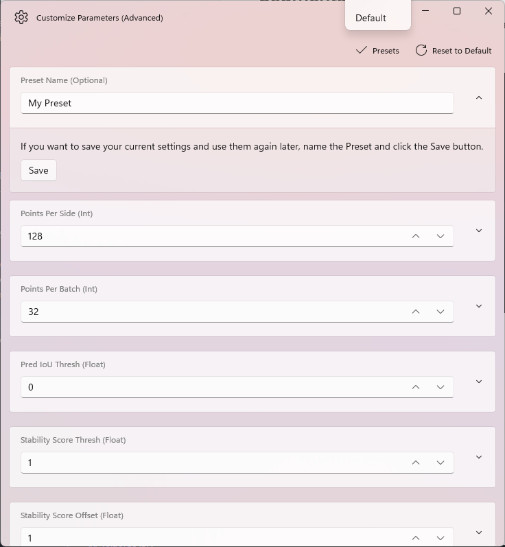 
> You can also save presets and use them again later. 

### Select Points 
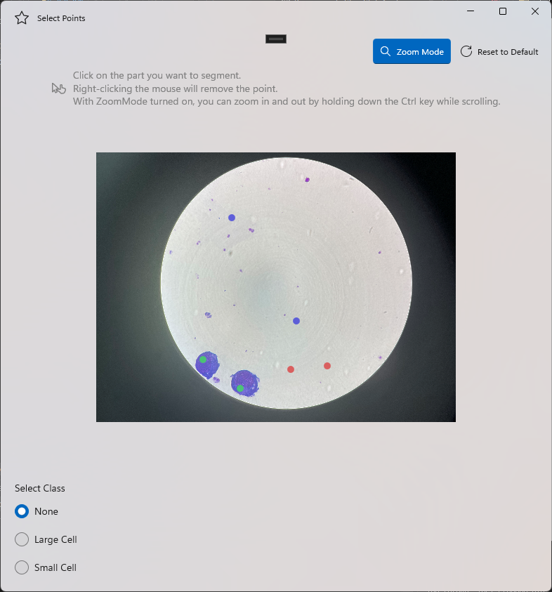 
> Segment only the parts you want accurately through Manual Segmentation. 

### Segmentation Result 
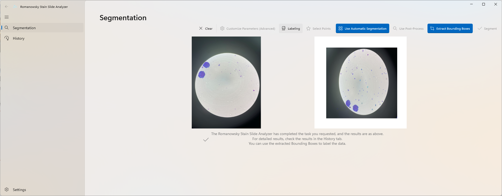 
> Just wait a moment and the segmentation results will be right before your eyes. 

## Labeling 
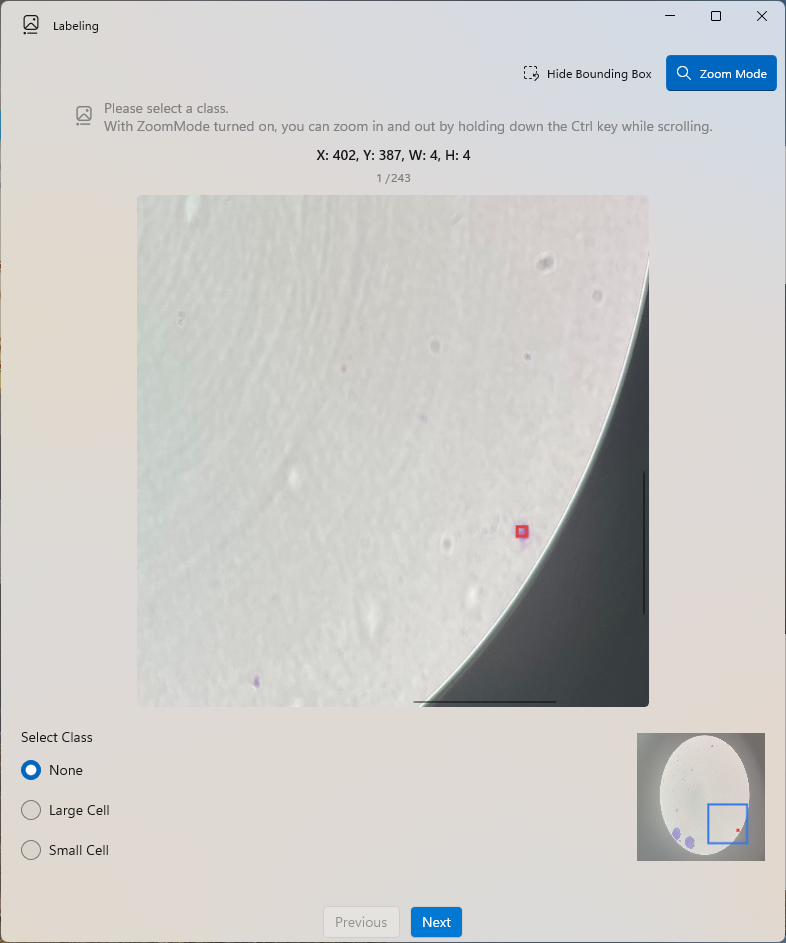 
> If you selected the Extract Bounding Boxes or Extract Masks option, try labeling using the Labeling function. 

### Export 
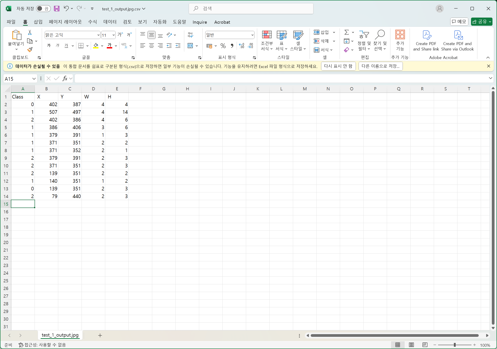 
> From labeling to exporting, all in one go. 

## History 
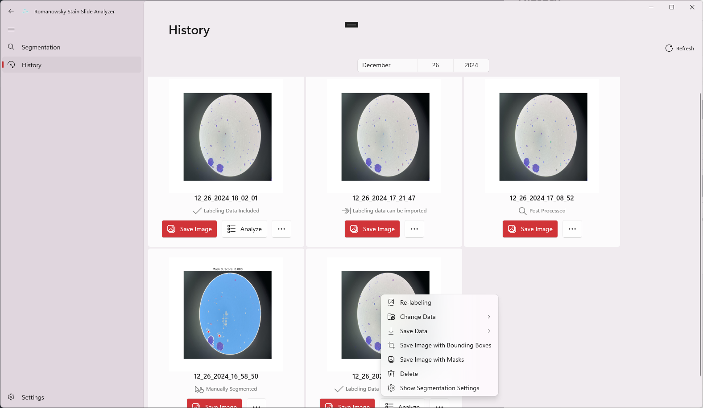 
> A strong assistant that not only checks and saves past results, but also replaces and exports labeling data, and analyzes and saves bounding boxes. 

## Image Viewer 
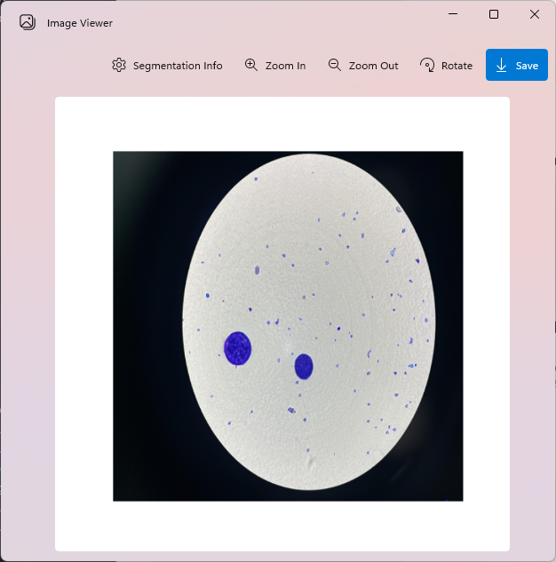 
> A simple yet powerful tool to view, zoom, rotate and save images. 

## Analyze 
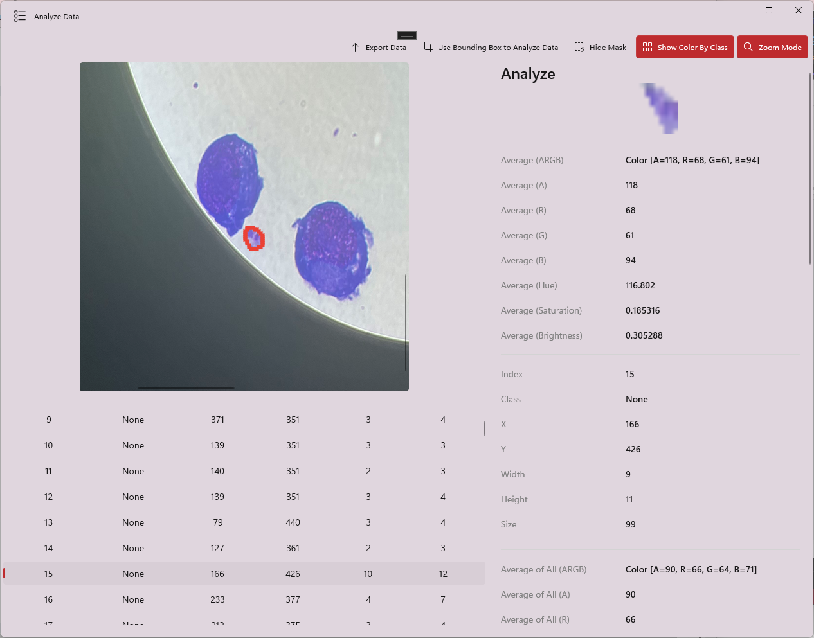 
> Once labeling is complete, try using the Analyze function, which analyzes ARGB, Hue, Saturation, and Brightness by class. 

### Export 
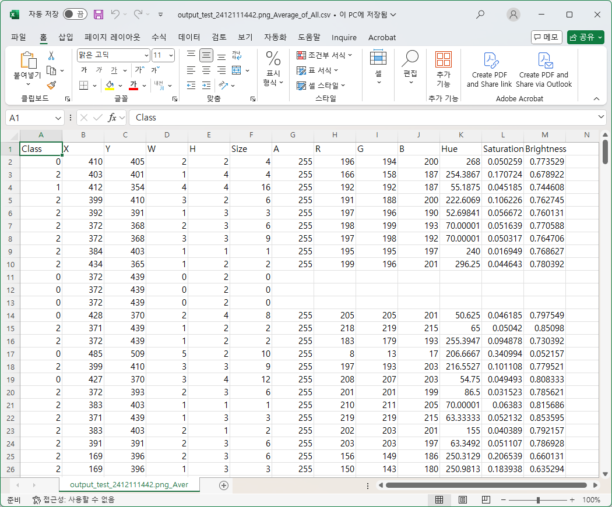 
> Of course, the Export function is built in as standard. 

## Settings 
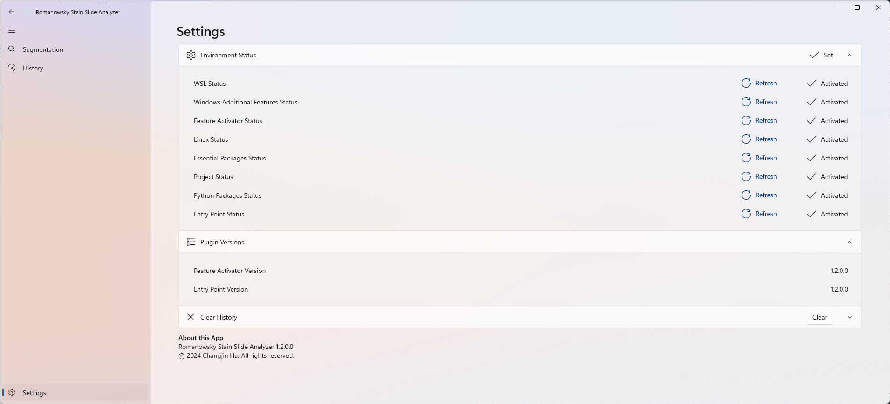 
> A smart friend that checks everything from history initialization to plugin version management and even environment status. 

## Configure Environment 
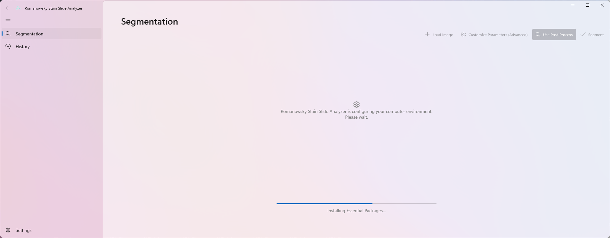 
> A solid feature that handles all environments at once, from checking WSL status to installation, Linux installation, SAM download, CUDA and cuDNN, Python installation, and even copying entry points. 

## Feature Activator 
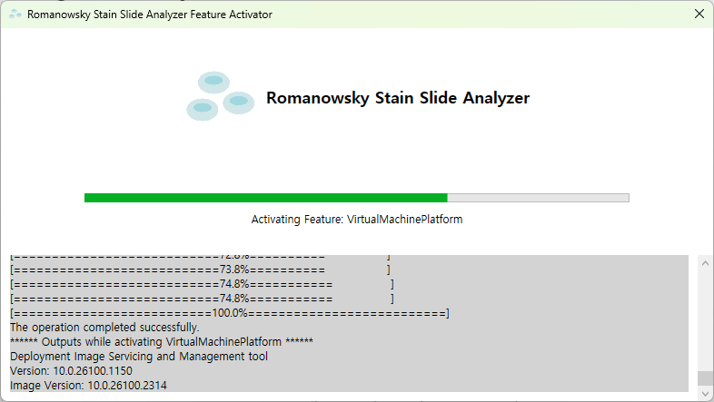 
> Are you having trouble installing Windows Additional Features and Linux? Feature Activator takes care of it all. 

## Compatibility 
> Romanowsky Stain Slide Analyzer for Windows is compatible with these devices. 

||Minimum Requirements|Recommended Requirements|
|-----|-----|-----|
|CPU|7th Gen. Intel Core i3|9th Gen. Intel Core i7|
|RAM|8GB|16GB|
|GPU|None|NVIDIA Geforce RTX 3060|
|Operating System|Windows 10 (x64, 22H2)|Windows 11|
|Storage|4GB HDD|8GB SSD|

## Release Note 
> Here are the release notes for each version of Romanowsky Stain Slide Analyzer for Windows. 

- ### Romanowsky Stain Slide Analyzer 1.4.0.0 Release Note
> #### Framework 
> - Saving a single file now displays the File Save Dialog instead of the Folder Picker, allowing you to customize the file's name and extension. 

> #### Segmentation 
> - Newly designed HomeView. 
> - You can now add files by dragging. 
> - You can now segment multiple images. 
> - You can now choose which GPU to use for inference. 
> - Parallel GPU option is now available. 
> - Shortcuts have been applied to some functions. 
> - The ability to cancel segmentation is now available. 
> - You can now apply the currently set options to all files. 
> - Model Selection is now available. 

> #### Customize Parameters 
> - Parameter Preset is now available. 
> - Number Box is now available. 

> #### History 
> - The History list is now displayed by file name. 
> - Shortcuts have been applied to some functions and menus. 
> - Image Viewer is now available. 
> - Calendar Date Picker is now available. 

> #### Labeling 
> - Now you can check the mask and bounding box at the same time. 
> - Shortcuts have been applied to some functions. 
> - Fixed the issue where Bounding Box indexes were not displayed completely. 

> #### Analyze 
> - You can now check mask data and bounding box data at the same time. 
> - Shortcuts have been applied to some functions. 

> #### Settings 
> - You can now delete the Preset. 

- ### Romanowsky Stain Slide Analyzer 1.3.0.0 Release Note
> #### Segmentation 
> - Extract Masks is now available. 
> - An option is available to save the image immediately after segmentation is complete. 

> #### History 
> - A completely new design for History View is now available. 
> - Re-labeling is now available. 
> - Save Mask Labeling Data is now available. 
> - Label Mask Data is now available. 
> - Save the masked image is available. 

> #### Labeling 
> - Toggle Bounding Box / Mask option is now available. 
> - Now when you click the back and next buttons, if there is any saved data it will be displayed. 

> #### Analyze 
> - The ability to analyze segmentation mask data is now available. 
> - Toggle Bounding Box / Mask option is now available. 
> - Fixed the issue where the average A value was not displayed properly when exporting data. 

- ### Romanowsky Stain Slide Analyzer 1.2.1.0 Release Note
> #### Feature Activator 
> - Fixed an issue where environment configuration was not performed properly on Windows 10. 
> #### Framework 
> - Improved environment configuration and segmentation to allow for drives other than C drive. 

- ### Romanowsky Stain Slide Analyzer 1.2.0.0 Release Note
> #### Select Points 
> - Fixed an issue where points were not displayed properly in Manually Segmentation mode 
> #### History 
> - Labeling Data Change is now available. 
> - Analyze Bounding Box is now available. 
> - Export Image with Bounding Boxes is now available. 
> #### Labeling 
> - Toggle Bounding Box Show/Hide is now available. 
> - Fixed an issue where blank spaces were appearing at the beginning of each piece of data. 
> - Automatic Zoom & Scroll is now available. 
> - Fixed an issue where labeling would be reset even if the Cancel button was pressed in the dialog that appears when there are already labeled files. 
> #### Analyze 
> - The Analyze feature is now available to view and export Color, Hue, Saturation, Brightness by Bounding Box and the overall Color, Hue, Saturation, Brightness average. 

- ### Romanowsky Stain Slide Analyzer 1.1.0.0 Release Note
> #### Segmentation 
> - Manually Segmentation is now available. 
> - Extract Bounding Boxes option is now available for extracting bounding box coordinates. 
> - Labeling is now available. 
> #### Select Points 
> - You can segment only that part by clicking on the part you want to segment with the mouse. 
> - You can specify the class of the area to be segmented. 
> #### Labeling 
> - You can specify a class for each bounding box area. 
> - You can export the labeled file to a csv file. 
> #### History 
> - You can save the result image file. 
> - You can re-save the labeled csv file. 
> - Fixed an issue where records would not display properly when the date was changed. 
> - Records are now displayed in most recent order. 
> #### Settings 
> - You can check and update each library version. 

- ### Romanowsky Stain Slide Analyzer 1.0.0.0 Release Note
> #### Segmentation 
> - Automatic Segmentation is now available. 
> - Customize Parameters is now available. 
> #### History 
> - History is now available. 
> #### Settings 
> - Check Environment configure status is now available. 
> #### Environment 
> - Romanowsky Stain Slide Analyzer Feature Activator is now available. 
> - Automatic configure environment is now available. 
